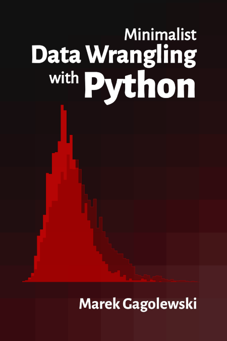

# Minimalist Data Wrangling with Python

*Minimalist Data Wrangling with Python* by [Marek Gagolewski][1]
is envisaged as a student's first
introduction to data science, providing a high-level overview as well as
discussing key concepts in detail. We explore methods for
cleaning data gathered from different sources, transforming, selecting, and
extracting features, performing exploratory data analysis and dimensionality
reduction, identifying naturally occurring data clusters, modelling patterns in
data, comparing data between groups, and reporting the results.

For many students around the world, educational resources are hardly
affordable. Therefore, the author has decided that this book should remain
an independent, non-profit, open-access project.
Whilst, for some people, the presence of a "designer tag" from a
major publisher might still be a proxy for quality, it is his hope
that this publication will prove useful to those who seek knowledge for
knowledge's sake.

You can read it at:

* <https://datawranglingpy.gagolewski.com/> (a browser-friendly version)
* <https://datawranglingpy.gagolewski.com/datawranglingpy.pdf> (PDF)

A **printed version** can be ordered from
[Amazon](https://www.amazon.com/dp/0645571911):
[AU](https://amazon.com.au/dp/0645571911)
[CA](https://amazon.ca/dp/0645571911)
[DE](https://amazon.de/dp/0645571911)
[ES](https://amazon.es/dp/0645571911)
[FR](https://amazon.fr/dp/0645571911)
[IT](https://amazon.it/dp/0645571911)
[JP](https://amazon.co.jp/dp/0645571911)
[NL](https://amazon.nl/dp/0645571911)
[PL](https://amazon.pl/dp/0645571911)
[SE](https://amazon.se/dp/0645571911)
[UK](https://amazon.co.uk/dp/0645571911)
[US](https://amazon.com/dp/0645571911).
Note that the author gets 0% revenue from sales
(price = cost of printing + Amazon fee).
Let him know if you find a vendor who can deliver this book to some geographic
regions more cheaply.

**Please spread the news about this project.**

Consider citing this book as:
[Gagolewski M.][1] (2023), *Minimalist Data Wrangling with Python*,
Zenodo, Melbourne,
DOI: [10.5281/zenodo.6451068](https://dx.doi.org/10.5281/zenodo.6451068),
ISBN: 978-0-6455719-1-2,
URL: <https://datawranglingpy.gagolewski.com/>.

Any remarks and bug fixes are appreciated. Please submit them via
this repository's *Issues* tracker. Thank you.

## About the Author

Dr habil. [Marek Gagolewski][1]
is currently a Senior Lecturer in Applied AI at Deakin University in Melbourne,
Australia and an Associate Professor in Data Science at the Systems
Research Institute, Polish Academy of Sciences.

His research interests are related to data science, in particular: modelling
complex phenomena, developing usable, general-purpose algorithms, studying
their analytical properties, and finding out how people use, misuse,
understand, and misunderstand methods of data analysis in research, commercial,
and decision-making settings.

He's an author of 90+ publications, including journal papers
in outlets such as *Proceedings of the National Academy of Sciences (PNAS)*,
*Information Fusion*, *International Journal of Forecasting*,
*Statistical Modelling*, *Journal of Statistical Software*,
*Information Sciences*, *Knowledge-Based Systems*,
*IEEE Transactions on Fuzzy Systems*, and *Journal of Informetrics*.

In his "spare" time, he writes books for his students
(check out his [*Deep R Programming*](https://deepr.gagolewski.com/))
and develops open-source (libre) data analysis software, such as
[`stringi`](https://stringi.gagolewski.com) (one of the most often downloaded
R packages),
[`genieclust`](https://genieclust.gagolewski.com) (a fast and robust
hierarchical clustering algorithm in both Python and R),
and many [others](https://github.com/gagolews).

--------------------------------------------------------------------------------

Copyright (C) 2022–2023, [Marek Gagolewski][1]. Some rights reserved.

This material is licensed under the Creative Commons
[Attribution-NonCommercial-NoDerivatives 4.0 International][2] License
(CC BY-NC-ND 4.0).

[1]: https://www.gagolewski.com
[2]: https://creativecommons.org/licenses/by-nc-nd/4.0/
